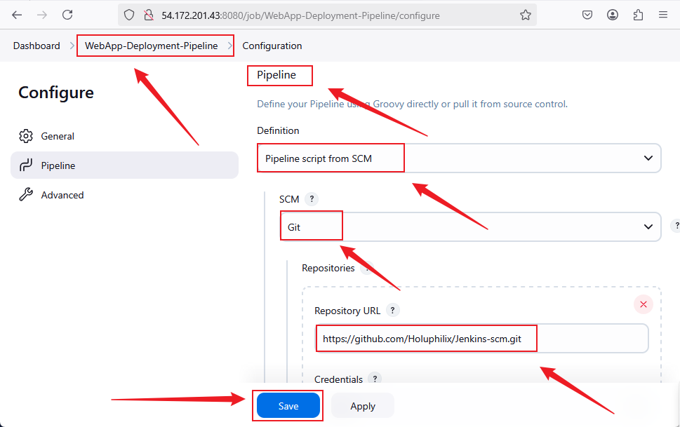
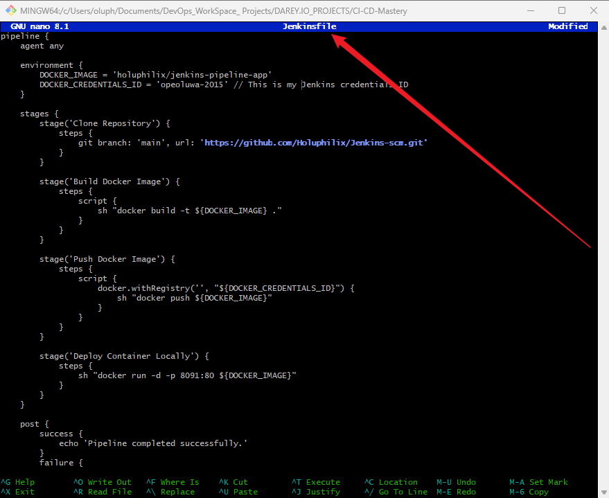

# Capstone Project : CI/CD Mastery 
 
## Introduction
Welcome to my **CI/CD Mastery** Capstone Project! As part of my DevOps journey, I have designed and implemented a robust **CI/CD pipeline** using **Jenkins** to automate the deployment of a web application. This project simulates a **real-world scenario** where a **technology consulting firm** is adopting cloud architecture, requiring a scalable and reliable CI/CD process.

This project focuses on **continuous integration (CI), continuous deployment (CD), and automation** to streamline software delivery. Below, you will find detailed steps on how the pipeline is structured and executed.

## Project Scenario
A technology consulting firm is transitioning to cloud-based software deployment. As a **DevOps Engineer**, my responsibility is to build an automated CI/CD pipeline to enhance efficiency and reliability in software deployment using **Jenkins, Docker, and GitHub**.

## Pre-requisites
To follow along with this project, ensure you have:

- Basic knowledge of Jenkins.
- Completed: 
  - Introduction to Jenkins
  - Jenkins Freestyle Project
  - Jenkins Pipeline Job mini projects
- A system with **Docker**, **Jenkins**, and **Git** installed.

## Project Deliverables

### Documentation
- Detailed setup instructions for Jenkins.
- Explanation of security measures implemented.

### Demonstration
- Live demonstration of the working **CI/CD pipeline**.

## Project Components

### Task 1: Implement Version Control with Git

#### Step 1.1: Initialize Git Repository

- To begin, create the project directory named MarketPeak_Ecommerce, navigate into it, and initialize it as a Git repository.

**Note:** For this project, I am using Git Bash on a Windows workstation to execute these shell commands, as it provides a Unix-like command-line experience.

**Command:**
```bash
mkdir CI-CD-Mastery
cd CI-CD-Mastery
git init
```
**Screenshot:** Project Directory CI-CD-Mastery


### Task 2: **Jenkins Server Setup**
#### Objetive: Configure Jenkins for CI/CD automation.

#### Steps 2.1: Run these commands one by one:

```bash
# Update system packages
sudo apt update -y && sudo apt upgrade -y  

# Install Java (required for Jenkins)
sudo apt install -y fontconfig openjdk-11-jdk  

# Add Jenkins repository key properly
curl -fsSL https://pkg.jenkins.io/debian-stable/jenkins.io-2023.key | sudo tee /usr/share/keyrings/jenkins-keyring.asc > /dev/null  

# Add the Jenkins repository
echo "deb [signed-by=/usr/share/keyrings/jenkins-keyring.asc] https://pkg.jenkins.io/debian-stable binary/" | sudo tee /etc/apt/sources.list.d/jenkins.list > /dev/null  

# Update package lists
sudo apt update  

# Install Jenkins
sudo apt install -y jenkins  

# Start and enable Jenkins service
sudo systemctl enable --now jenkins  

# Check Jenkins status
sudo systemctl status jenkins  
```
- Jenkins Status and Home Dashboard:

**Screenshot:** Jenkins Status Output


**Screenshot:** Jenkins Dashboard


#### Step 2.2: Security Measures:
- Set up **admin credentials**

**Screenshot:** Admin credentials


**Screenshot:** Create First Admin credentials


- Install essential plugins (**Git**, **Docker**, etc.).

**Screenshot:** Install essential plugin Git


**Screenshot:** Install essential plugin Docker


### Task 3: **Source Code Management (SCM) Integration**
#### Objective: Connect Jenkins to **GitHub** for automated builds.

#### Step 3.1:

```bash
# Install Git
sudo apt install -y git

# Clone the repository
git clone https://github.com/Holuphilix/Jenkins-scm.git
```
- Install **Git** on EC2 instance

**Screenshot:** Install Git


- Connect Jenkins to **GitHub**

**Screenshot:** Connect Jenkins


- Configure **webhooks** in GitHub to trigger builds automatically.

**Screenshot:** GitHub Webhook Setup 
 

### Task 4: **Jenkins Freestyle Job for Build and Unit Tests**
#### Objective: Automate application builds and unit tests.

#### **Steps to Create the Job:**
1. **Login to Jenkins** and click **"New Item"**.
2. Enter a job name: `Build-and-Test-Job`.
3. Select **"Freestyle project"** and click **OK**.

**Screenshot:** New Item `Build-and-Test-Job`


4. Under **"Source Code Management"**, select **Git** and enter the repository URL:

```sh
https://github.com/Holuphilix/jenkins-scm.git
```

**Screenshot:** Connect Jenkins


5. Under **"Build Triggers"**, enable **Poll SCM** or configure a **Webhook**.

- **Screenshot:** Enable Poll SCM


6. Click **Save**, then click **Build Now** to test.

- **Screenshot:** Build Now Status


- **Screenshot:** Console Output


### **Task 5: Pipeline Job for Web Application Deployment**
**Objective:** Automate the web application deployment using Jenkins Pipeline and Docker.

#### **Steps to Create the Job:**
1. Click **"New Item"**, enter `WebApp-Pipeline`, and select **"Pipeline"**.
2. Click **OK**

**Screenshot:**  New Item `WebApp-Pipeline`


3. Under **"Pipeline"**, select **Pipeline script from SCM**
4. Choose **Git** and enter the repository URL:
   ```sh
   https://github.com/Holuphilix/jenkins-scm.git
   ```

**Screenshot:**  Pipeline SCM `WebApp-Pipeline`


5. Set **Branch** to `main`.
6. In **Script Path**, enter:

```sh
WebApp-Pipeline/Jenkinsfile
```

**Screenshot:** Script Path: WebApp-Pipeline/Jenkinsfile


7. Click **Save**, then click **Build Now** to test.

- **Screenshot:** Build Now Status


- **Console Output:** 
```groovy
  Started by user Philip Oludolamu
Obtained Jenkinsfile from git https://github.com/Holuphilix/Jenkins-scm.git
[Pipeline] Start of Pipeline
[Pipeline] node
Running on Jenkins in /var/lib/jenkins/workspace/WebApp-Pipeline
[Pipeline] {
[Pipeline] stage
[Pipeline] { (Declarative: Checkout SCM)
[Pipeline] checkout
Selected Git installation does not exist. Using Default
The recommended git tool is: NONE
No credentials specified
 > git rev-parse --resolve-git-dir /var/lib/jenkins/workspace/WebApp-Pipeline/.git # timeout=10
Fetching changes from the remote Git repository
 > git config remote.origin.url https://github.com/Holuphilix/Jenkins-scm.git # timeout=10
Fetching upstream changes from https://github.com/Holuphilix/Jenkins-scm.git
 > git --version # timeout=10
 > git --version # 'git version 2.43.0'
 > git fetch --tags --force --progress -- https://github.com/Holuphilix/Jenkins-scm.git +refs/heads/*:refs/remotes/origin/* # timeout=10
 > git rev-parse refs/remotes/origin/main^{commit} # timeout=10
Checking out Revision b6aa1e2b608c0bca173b4756cefda400e623cac9 (refs/remotes/origin/main)
 > git config core.sparsecheckout # timeout=10
 > git checkout -f b6aa1e2b608c0bca173b4756cefda400e623cac9 # timeout=10
Commit message: "Initial commit with pipeline files"
 > git rev-list --no-walk b6aa1e2b608c0bca173b4756cefda400e623cac9 # timeout=10
[Pipeline] }
[Pipeline] // stage
[Pipeline] withEnv
[Pipeline] {
[Pipeline] stage
[Pipeline] { (Checkout Code)
[Pipeline] checkout
The recommended git tool is: NONE
No credentials specified
 > git rev-parse --resolve-git-dir /var/lib/jenkins/workspace/WebApp-Pipeline/.git # timeout=10
Fetching changes from the remote Git repository
 > git config remote.origin.url https://github.com/Holuphilix/jenkins-scm.git # timeout=10
Fetching upstream changes from https://github.com/Holuphilix/jenkins-scm.git
 > git --version # timeout=10
 > git --version # 'git version 2.43.0'
 > git fetch --tags --force --progress -- https://github.com/Holuphilix/jenkins-scm.git +refs/heads/*:refs/remotes/origin/* # timeout=10
 > git rev-parse refs/remotes/origin/main^{commit} # timeout=10
Checking out Revision b6aa1e2b608c0bca173b4756cefda400e623cac9 (refs/remotes/origin/main)
 > git config core.sparsecheckout # timeout=10
 > git checkout -f b6aa1e2b608c0bca173b4756cefda400e623cac9 # timeout=10
Commit message: "Initial commit with pipeline files"
 > git rev-list --no-walk b6aa1e2b608c0bca173b4756cefda400e623cac9 # timeout=10
[Pipeline] }
[Pipeline] // stage
[Pipeline] stage
[Pipeline] { (Build Docker Image)
[Pipeline] script
[Pipeline] {
[Pipeline] sh
+ docker build -t my-webapp .
DEPRECATED: The legacy builder is deprecated and will be removed in a future release.
            Install the buildx component to build images with BuildKit:
            https://docs.docker.com/go/buildx/

Sending build context to Docker daemon  2.572MB

Step 1/3 : FROM nginx:latest
latest: Pulling from library/nginx
c29f5b76f736: Pulling fs layer
e19db8451adb: Pulling fs layer
24ff42a0d907: Pulling fs layer
c558df217949: Pulling fs layer
976e8f6b25dd: Pulling fs layer
6c78b0ba1a32: Pulling fs layer
84cade77a831: Pulling fs layer
c558df217949: Waiting
976e8f6b25dd: Waiting
6c78b0ba1a32: Waiting
84cade77a831: Waiting
24ff42a0d907: Verifying Checksum
24ff42a0d907: Download complete
c558df217949: Verifying Checksum
c558df217949: Download complete
976e8f6b25dd: Verifying Checksum
976e8f6b25dd: Download complete
6c78b0ba1a32: Verifying Checksum
6c78b0ba1a32: Download complete
c29f5b76f736: Verifying Checksum
c29f5b76f736: Download complete
e19db8451adb: Verifying Checksum
e19db8451adb: Download complete
84cade77a831: Verifying Checksum
84cade77a831: Download complete
c29f5b76f736: Pull complete
e19db8451adb: Pull complete
24ff42a0d907: Pull complete
c558df217949: Pull complete
976e8f6b25dd: Pull complete
6c78b0ba1a32: Pull complete
84cade77a831: Pull complete
Digest: sha256:91734281c0ebfc6f1aea979cffeed5079cfe786228a71cc6f1f46a228cde6e34
Status: Downloaded newer image for nginx:latest
 ---> 97662d24417b
Step 2/3 : COPY index.html /usr/share/nginx/html/index.html
 ---> c21f664880db
Step 3/3 : EXPOSE 80
 ---> Running in 0d532026fab9
 ---> Removed intermediate container 0d532026fab9
 ---> 59c822f21ac1
Successfully built 59c822f21ac1
Successfully tagged my-webapp:latest
[Pipeline] }
[Pipeline] // script
[Pipeline] }
[Pipeline] // stage
[Pipeline] stage
[Pipeline] { (Run Docker Container)
[Pipeline] script
[Pipeline] {
[Pipeline] sh
+ docker run -itd -p 8081:80 my-webapp
84598abbef87571a2aff721ea8c0211e7c042b624823a1b6de70fbb0214c6654
[Pipeline] }
[Pipeline] // script
[Pipeline] }
[Pipeline] // stage
[Pipeline] }
[Pipeline] // withEnv
[Pipeline] }
[Pipeline] // node
[Pipeline] End of Pipeline
Finished: SUCCESS
```

#### **Jenkinsfile Script for WebApp Pipeline:**

```groovy
pipeline {
    agent any

    stages {
        stage('Checkout Code') {
            steps {
                checkout([$class: 'GitSCM',
                          branches: [[name: '*/main']],
                          extensions: [],
                          userRemoteConfigs: [[url: 'https://github.com/Holuphilix/jenkins-scm.git']]
                ])
            }
        }
        stage('Build Docker Image') {
            steps {
                script {
                    sh 'docker build -t my-webapp .'  
                }
            }
        }
        stage('Run Docker Container') {
            steps {
                script {
                    sh 'docker run -itd -p 8081:80 my-webapp'
                }
            }
        }
    }
}
```

**Screenshot:** Jenkins Pipeline Execution


#### **Dockerfile Script for WebApp Pipeline:**

```groovy
# Use an official Nginx image as the base image
FROM nginx:latest

# Copy the web application files to the container
COPY index.html /usr/share/nginx/html/index.html

# Expose port 80
EXPOSE 80
```

**Screenshot:** Dockerfile Execution


#### **index.html Script for WebApp Pipeline:**

```groovy
<!DOCTYPE html>
<html lang="en">
<head>
    <meta charset="UTF-8">
    <meta name="viewport" content="width=device-width, initial-scale=1.0">
    <title>My Web App</title>
</head>
<body>
    <h1>Welcome to My CI/CD Web App!</h1>
    <p>Deployed using Jenkins and Docker.</p>
</body>
</html>
```

**Screenshot:** Index.html Execution


#### **.gitignore Script for WebApp Pipeline:**

```groovy
# Ignore temporary files
*.log
*.tmp
*.swp
# Ignore Node modules (if applicable)
node_modules/
# Ignore Python virtual environment
venv/
# Ignore Docker cache
*.tar
```

**Screenshot:** .gitignore Execution


## **Task 6: Docker Image Creation and Push to Docker Hub**

### **Objective**
Automate the creation of a Docker image for the web application and push it to Docker Hub using Jenkins.

### **Step 1: Update Jenkinsfile in GitHub Repository**
Modify the `Jenkinsfile` in your repository to include Docker image creation and pushing to Docker Hub.

#### **Updated Jenkinsfile:**

```groovy
pipeline {
    agent any

    environment {
        DOCKER_IMAGE = "your-dockerhub-username/my-webapp:latest"
    }

    stages {
        stage('Checkout Code') {
            steps {
                checkout([$class: 'GitSCM', 
                          branches: [[name: '*/main']], 
                          extensions: [], 
                          userRemoteConfigs: [[url: 'https://github.com/Holuphilix/jenkins-scm.git']]
                ])
            }
        }
        stage('Build Docker Image') {
            steps {
                script {
                    sh 'docker build -t $DOCKER_IMAGE .'
                }
            }
        }
        stage('Push Docker Image to Docker Hub') {
            steps {
                script {
                    sh 'docker push $DOCKER_IMAGE'
                }
            }
        }
        stage('Run Docker Container') {
            steps {
                script {
                    sh 'docker run -itd -p 8081:80 $DOCKER_IMAGE'
                }
            }
        }
    }
}
```

### **Step 2: Commit and Push Changes**

#### After updating the Jenkinsfile, save the changes and push them to your GitHub repository.

**Commands:**

```bash
git add Jenkinsfile
git commit -m "Updated Jenkinsfile for Docker image creation and push"
git push origin main
```
### **Step 3: Create a New Jenkins Job**

1. Open Jenkins Dashboard.
2. Click "New Item".
3. Enter **Docker-Pipeline**, select "Pipeline", and click OK.

**Screenshot:**  New Item `Docker-Pipeline`


4. Under Pipeline, select Pipeline script from SCM.
5. Choose Git and enter:

**Screenshot:** Docker-Pipeline SCM  `Docker-Pipeline`


```sh
https://github.com/Holuphilix/jenkins-scm.git
```

6. Set Branch to main.
7. In Script Path, enter:

```sh
Docker-Pipeline/Jenkinsfile
```

**Screenshot:**  Script Path `Docker-Pipeline/Jenkinsfile
`


8. Click Save.

### Step 4: Trigger the Build

1. Navigate to the Docker-Pipeline job in Jenkins.
2. Click "Build Now".
3. Monitor the Console Output for errors.

### Expected Outcome
**The Jenkins pipeline should:** 
    ✅ Pull the source code from GitHub.
    ✅ Build a Docker image.
    ✅ Push the image to Docker Hub.
    ✅ Deploy and run the container using the built Docker image.

### Conclusion

By completing this step, we have successfully automated the deployment process using **Jenkins, Docker, and GitHub**. The Docker image is now hosted in **Docker Hub**, making it easier to deploy the web application across different environments.

### Key Achievements
- Automated **code integration and testing**.
- Created **Jenkins jobs** for different stages.
- Built and deployed a **Dockerized application**.
- Published a Docker image to **Docker Hub**.

### Future Improvements
- Implement **Jenkinsfile** in a more advanced **multi-branch pipeline**.
- Integrate **Kubernetes** for better **orchestration**.
- Automate **testing with Selenium**.

### Author
**Holuphilix** – *Aspiring DevOps Engineer* 🚀

🔗 **GitHub Repository:** [Holuphilix/jenkins-scm](https://github.com/Holuphilix/jenkins-scm)

💡 **Let's Connect:** [LinkedIn Profile](#)

Happy Learning! 🎯
