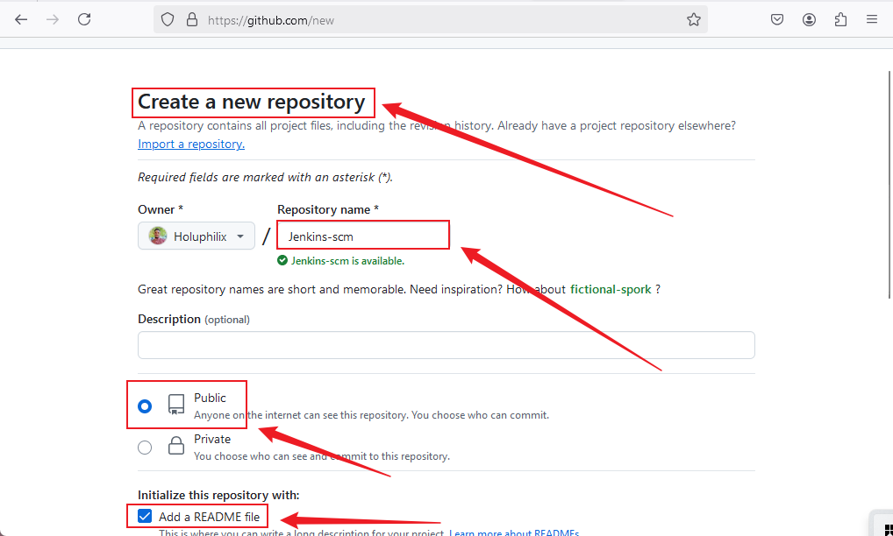
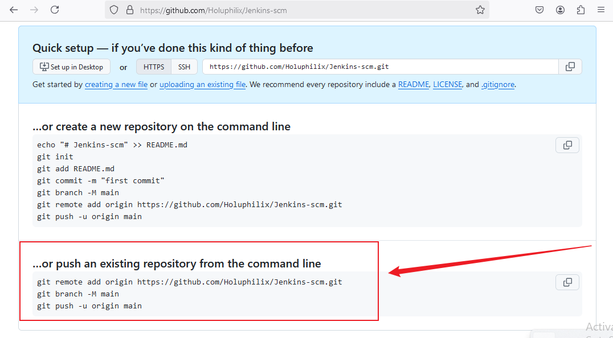
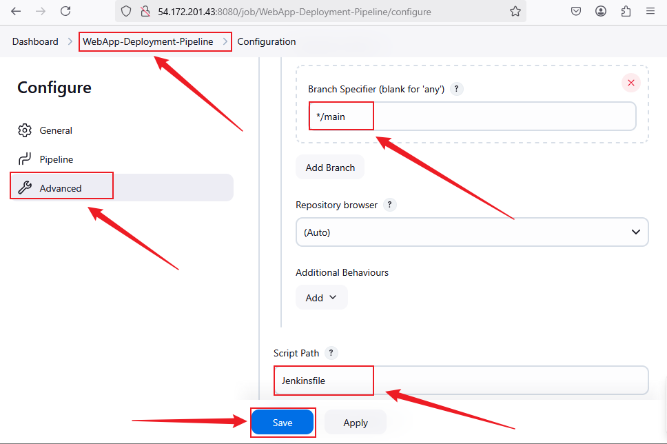
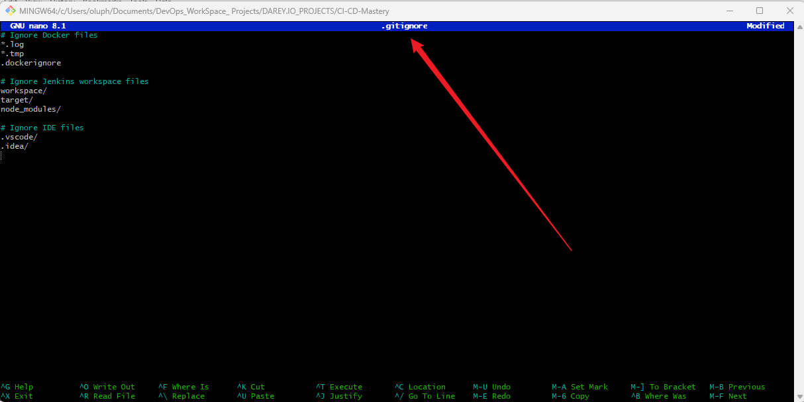

# Capstone Project : CI/CD Mastery 
 
## Introduction
Welcome to my **CI/CD Mastery** Capstone Project! As part of my DevOps journey, I have designed and implemented a robust **CI/CD pipeline** using **Jenkins** to automate the deployment of a web application. This project simulates a **real-world scenario** where a **technology consulting firm** is adopting cloud architecture, requiring a scalable and reliable CI/CD process.

This project focuses on **continuous integration (CI), continuous deployment (CD), and automation** to streamline software delivery. Below, you will find detailed steps on how the pipeline is structured and executed.

## Project Scenario
A technology consulting firm is transitioning to cloud-based software deployment. As a **DevOps Engineer**, my responsibility is to build an automated CI/CD pipeline to enhance efficiency and reliability in software deployment using **Jenkins, Docker, and GitHub**.

## Pre-requisites
To follow along with this project, ensure you have:

- Basic knowledge of Jenkins.
- Completed: 
  - Introduction to Jenkins
  - Jenkins Freestyle Project
  - Jenkins Pipeline Job mini projects
- A system with **Docker**, **Jenkins**, and **Git** installed.

## Project Deliverables

### Documentation
- Detailed setup instructions for Jenkins.
- Explanation of security measures implemented.

### Demonstration
- Live demonstration of the working **CI/CD pipeline**.

## Project Components

### Task 1: Implement Version Control with Git

#### Step 1.1: Initialize Git Repository

- To begin, create the project directory named MarketPeak_Ecommerce, navigate into it, and initialize it as a Git repository.

**Note:** For this project, I am using Git Bash on a Windows workstation to execute these shell commands, as it provides a Unix-like command-line experience.

**Command:**
```bash
mkdir CI-CD-Mastery
cd CI-CD-Mastery
git init
```

**Screenshot:** Project Directory CI-CD-Mastery


#### Step 1.2: Stage and Commit the Template to Git

In this step, I will add the website files to the Git repository, configure my global Git settings, and make an initial commit with a descriptive message.

- Add Files: Add all website files to the staging area.

- Configure Git User Information: Set up global configuration with my actual git username and email address.

- Commit Changes: Commit the changes with a clear and descriptive message.

**Commands:**
```bash
git add .
git config --global user.name "YourUsername"
git config --global user.email "youremail@example.com"
git commit -m "Updated Jenkinsfile for Docker build and push pipeline"
```

#### Step 1.3: Push the code to your Github repository

After initializing your Git repository and adding your updated project files (including the Jenkinsfile and other necessary scripts), the next step is to push your code to a remote repository on GitHub. This step is crucial for version control and collaboration.

- Create a Remote Repository on GitHub: Log into your GitHub account and create a new repository named Jenkins-scm. Leave the repository empty without initializing it with a README, .gitignore, or license.

**Screenshot:** Create New Repository


- Link Your Local Repository to GitHub: In your terminal, within your project directory, add the remote repository URL to your local repository configuration.

- Push Your Code: Upload Your Local Repository Content to GitHub Once you have linked your local repository to GitHub, use the following command to push your commits from your local main branch to the remote repository. This enables you to store your project in the cloud and share it with others.

**Screenshot:** Push to Repository


**Commands:**
```bash
git remote add origin https://github.com/Holuphilix/Jenkins-scm.git
git branch -M main
git push -u origin main
```

### Task 2: **Jenkins Server Setup**
#### Objetive: Configure Jenkins for CI/CD automation.

#### Steps 2.1: Run these commands one by one:

```bash
# Update system packages
sudo apt update -y && sudo apt upgrade -y  

# Install Java (required for Jenkins)
sudo apt install -y fontconfig openjdk-11-jdk  

# Add Jenkins repository key properly
curl -fsSL https://pkg.jenkins.io/debian-stable/jenkins.io-2023.key | sudo tee /usr/share/keyrings/jenkins-keyring.asc > /dev/null  

# Add the Jenkins repository
echo "deb [signed-by=/usr/share/keyrings/jenkins-keyring.asc] https://pkg.jenkins.io/debian-stable binary/" | sudo tee /etc/apt/sources.list.d/jenkins.list > /dev/null  

# Update package lists
sudo apt update  

# Install Jenkins
sudo apt install -y jenkins  

# Start and enable Jenkins service
sudo systemctl enable --now jenkins  

# Check Jenkins status
sudo systemctl status jenkins  
```
- Jenkins Status and Home Dashboard:

**Screenshot:** Jenkins Status Output


**Screenshot:** Jenkins Dashboard


#### Step 2.2: Security Measures:

- Set up **admin credentials**

**Screenshot:** Admin credentials


**Screenshot:** Create First Admin credentials


- Install essential plugins (**Git**, **Docker**, etc.).

**Screenshot:** Install essential plugin Git


**Screenshot:** Install essential plugin Docker


### Task 3: **Source Code Management (SCM) Integration**
#### Objective: Connect Jenkins to **GitHub** for automated builds.

#### Step 3.1:

```bash
# Install Git
sudo apt install -y git

# Clone the repository
git clone https://github.com/Holuphilix/Jenkins-scm.git
```
- Install **Git** on EC2 instance

**Screenshot:** Install Git


- Connect Jenkins to **GitHub**

**Screenshot:** Connect Jenkins


- Configure **webhooks** in GitHub to trigger builds automatically.

**Screenshot:** GitHub Webhook Setup 
 

### Task 4: **Jenkins Freestyle Job for Build and Unit Tests**
#### Objective: Automate application builds and unit tests.

#### **Steps to Create the Job:**
1. **Login to Jenkins** and click **"New Item"**.
2. Enter a job name: `Build-and-Test-Job`.
3. Select **"Freestyle project"** and click **OK**.

**Screenshot:** New Item `Build-and-Test-Job`


4. Under **"Source Code Management"**, select **Git** and enter the repository URL:

```sh
https://github.com/Holuphilix/jenkins-scm.git
```

**Screenshot:** Connect Jenkins


5. Under **"Build Triggers"**, enable **Poll SCM** or configure a **Webhook**.

- **Screenshot:** Enable Poll SCM


6. Click **Save**, then click **Build Now** to test.

- **Screenshot:** Build Now Status


- **Screenshot:** Console Output


### **Task 5 & 6: Pipeline Job for Web Application Deployment and Docker Image Push**

**Objective:** Automate the web application deployment process using Jenkins Pipeline and Docker. This task involves building a Docker image for the web application, pushing the image to DockerHub, and deploying the application as a running container.

#### **Step 1: How to Create the Job:**

1. Click **"New Item"**, enter `WebApp-Deployment-Pipeline`, and select **"Pipeline"**.
2. Click **OK**

**Screenshot:**  New Item `WebApp-Deployment-Pipeline`


3. Under **"Pipeline"**, select **Pipeline script from SCM**
4. Choose **Git** and enter the repository URL:
   
```sh
https://github.com/Holuphilix/Jenkins-scm.git
```

**Screenshot:**  Pipeline SCM `WebApp-Deployment-Pipeline`


5. Set **Branch** to `main`.
6. In **Script Path**, enter:

```sh
Jenkinsfile
```

**Screenshot:** Script Path: Jenkinsfile



#### **Step 2: index.html Script for WebApp-Deployment-Pipeline:**

```groovy
<!DOCTYPE html>
<html>
<head>
    <title>Jenkins CI/CD Pipeline</title>
</head>
<body>
    <h1>Welcome to My Web Application</h1>
    <p>Deployed using Jenkins CI/CD Pipeline</p>
</body>
</html>
```

**Screenshot:** Index.html Execution


#### **Step 3: Create a Repository on DockerHub:**

1. Log in to DockerHub:
- Visit https://hub.docker.com/ and log in to your account.

2. Create a New Repository:
- Click on Create Repository.

3. Fill in the Details:
- Repository Name: jenkins-pipeline-app
- Visibility: Choose Public or Private (Public is free and easier to access).
- Leave other options as default.

4. Save:
- Click Create to save the repository.

**Screenshot:** Dockerhub Repository Name 


#### **Step 4: Jenkinsfile Script for WebApp-Deployment-Pipeline:**

The `Jenkinsfile` in your repository to include Docker image creation and pushing to Docker Hub.

```groovy
pipeline {
    agent any

    environment {
        DOCKER_IMAGE = 'holuphilix/jenkins-pipeline-app'
        DOCKER_CREDENTIALS_ID = 'opeoluwa-2015' // Update this with your Jenkins credentials ID
    }

    stages {
        stage('Clone Repository') {
            steps {
                git branch: 'main', url: 'https://github.com/Holuphilix/Jenkins-scm.git'
            }
        }

        stage('Build Docker Image') {
            steps {
                script {
                    sh "docker build -t ${DOCKER_IMAGE} ."
                }
            }
        }

        stage('Push Docker Image') {
            steps {
                script {
                    docker.withRegistry('', "${DOCKER_CREDENTIALS_ID}") {
                        sh "docker push ${DOCKER_IMAGE}"
                    }
                }
            }
        }

        stage('Deploy Container Locally') {
            steps {
                sh "docker run -d -p 8091:80 ${DOCKER_IMAGE}"
            }
        }
    }

    post {
        success {
            echo 'Pipeline completed successfully.'
        }
        failure {
            echo 'Pipeline failed.'
        }
    }
}
```

**Screenshot:** Jenkins Pipeline Execution


#### **Step 5: Create Dockerfile Script for WebApp-Deployment-Pipeline:**

```groovy
# Use an official Nginx image as the base image
FROM nginx:latest

# Copy the web application files to the container
COPY index.html /usr/share/nginx/html/index.html

# Expose port 80
EXPOSE 80
```

**Screenshot:** Dockerfile Execution


#### **Step 6: Create .gitignore Script for WebApp-Deployment-Pipeline:**

```groovy
# Ignore temporary files
*.log
*.tmp
*.swp
# Ignore Node modules (if applicable)
node_modules/
# Ignore Python virtual environment
venv/
# Ignore Docker cache
*.tar
```

**Screenshot:** .gitignore Execution


#### **Step 7: Trigger the Build**

1. Navigate to the **WebApp-Deployment-Pipeline** job in Jenkins.
2. Click "Build Now".
3. Monitor the logs for each stage.

**Screenshot:** Jenkins Status Pipeline


### Expected Outcome

#### **Steps 1: Jenkins Console Output**

The Jenkins pipeline logs provide a detailed overview of each stage executed during the build process, including cloning the repository, building the Docker image, Image push to DockerHub and Deployment of the containerized application. Below is a screenshot of the successful pipeline execution:

```groovy
Started by GitHub push by Holuphilix
Obtained Jenkinsfile from git https://github.com/Holuphilix/Jenkins-scm.git
[Pipeline] Start of Pipeline
[Pipeline] node
Running on Jenkins in /var/lib/jenkins/workspace/WebApp-Deployment-Pipeline
[Pipeline] {
[Pipeline] stage
[Pipeline] { (Declarative: Checkout SCM)
[Pipeline] checkout
Selected Git installation does not exist. Using Default
The recommended git tool is: NONE
No credentials specified
 > git rev-parse --resolve-git-dir /var/lib/jenkins/workspace/WebApp-Deployment-Pipeline/.git # timeout=10
Fetching changes from the remote Git repository
 > git config remote.origin.url https://github.com/Holuphilix/Jenkins-scm.git # timeout=10
Fetching upstream changes from https://github.com/Holuphilix/Jenkins-scm.git
 > git --version # timeout=10
 > git --version # 'git version 2.43.0'
 > git fetch --tags --force --progress -- https://github.com/Holuphilix/Jenkins-scm.git +refs/heads/*:refs/remotes/origin/* # timeout=10
 > git rev-parse refs/remotes/origin/main^{commit} # timeout=10
Checking out Revision 4d833dc1ebe82499e21f569e282cd4f4ea66fb51 (refs/remotes/origin/main)
 > git config core.sparsecheckout # timeout=10
 > git checkout -f 4d833dc1ebe82499e21f569e282cd4f4ea66fb51 # timeout=10
Commit message: "Updated Readme.md for Docker image creation and push"
 > git rev-list --no-walk 9e51d506b26d74939f04165e25a99542c4b63590 # timeout=10
[Pipeline] }
[Pipeline] // stage
[Pipeline] withEnv
[Pipeline] {
[Pipeline] withEnv
[Pipeline] {
[Pipeline] stage
[Pipeline] { (Clone Repository)
[Pipeline] git
Selected Git installation does not exist. Using Default
The recommended git tool is: NONE
No credentials specified
 > git rev-parse --resolve-git-dir /var/lib/jenkins/workspace/WebApp-Deployment-Pipeline/.git # timeout=10
Fetching changes from the remote Git repository
 > git config remote.origin.url https://github.com/Holuphilix/Jenkins-scm.git # timeout=10
Fetching upstream changes from https://github.com/Holuphilix/Jenkins-scm.git
 > git --version # timeout=10
 > git --version # 'git version 2.43.0'
 > git fetch --tags --force --progress -- https://github.com/Holuphilix/Jenkins-scm.git +refs/heads/*:refs/remotes/origin/* # timeout=10
 > git rev-parse refs/remotes/origin/main^{commit} # timeout=10
Checking out Revision 4d833dc1ebe82499e21f569e282cd4f4ea66fb51 (refs/remotes/origin/main)
 > git config core.sparsecheckout # timeout=10
 > git checkout -f 4d833dc1ebe82499e21f569e282cd4f4ea66fb51 # timeout=10
 > git branch -a -v --no-abbrev # timeout=10
 > git branch -D main # timeout=10
 > git checkout -b main 4d833dc1ebe82499e21f569e282cd4f4ea66fb51 # timeout=10
Commit message: "Updated Readme.md for Docker image creation and push"
[Pipeline] }
[Pipeline] // stage
[Pipeline] stage
[Pipeline] { (Build Docker Image)
[Pipeline] script
[Pipeline] {
[Pipeline] sh
+ docker build -t holuphilix/jenkins-pipeline-app .
DEPRECATED: The legacy builder is deprecated and will be removed in a future release.
            Install the buildx component to build images with BuildKit:
            https://docs.docker.com/go/buildx/

Sending build context to Docker daemon  3.993MB

Step 1/4 : FROM nginx:latest
 ---> 97662d24417b
Step 2/4 : WORKDIR  /usr/share/nginx/html/
 ---> Using cache
 ---> d57cdef5c6b7
Step 3/4 : COPY index.html /usr/share/nginx/html/
 ---> Using cache
 ---> 6c6da874730b
Step 4/4 : EXPOSE 80
 ---> Using cache
 ---> e0d3174d1d27
Successfully built e0d3174d1d27
Successfully tagged holuphilix/jenkins-pipeline-app:latest
[Pipeline] }
[Pipeline] // script
[Pipeline] }
[Pipeline] // stage
[Pipeline] stage
[Pipeline] { (Push Docker Image)
[Pipeline] script
[Pipeline] {
[Pipeline] withEnv
[Pipeline] {
[Pipeline] withDockerRegistry
$ docker login -u holuphilix -p ******** https://index.docker.io/v1/
WARNING! Using --password via the CLI is insecure. Use --password-stdin.
WARNING! Your password will be stored unencrypted in /var/lib/jenkins/workspace/WebApp-Deployment-Pipeline@tmp/af629a9c-98e3-4924-aa51-dd2ae3a89dce/config.json.
Configure a credential helper to remove this warning. See
https://docs.docker.com/engine/reference/commandline/login/#credentials-store

Login Succeeded
[Pipeline] {
[Pipeline] sh
+ docker push holuphilix/jenkins-pipeline-app
Using default tag: latest
The push refers to repository [docker.io/holuphilix/jenkins-pipeline-app]
9f28838ef0fc: Preparing
1fb7f1e96249: Preparing
d6266720b0a6: Preparing
2ef6413cdcb5: Preparing
320c70dd6b6b: Preparing
17129ef2de1a: Preparing
9574fd0ae014: Preparing
7914c8f600f5: Preparing
17129ef2de1a: Waiting
9574fd0ae014: Waiting
7914c8f600f5: Waiting
d6266720b0a6: Layer already exists
1fb7f1e96249: Layer already exists
320c70dd6b6b: Layer already exists
9f28838ef0fc: Layer already exists
17129ef2de1a: Layer already exists
2ef6413cdcb5: Layer already exists
9574fd0ae014: Layer already exists
7914c8f600f5: Layer already exists
latest: digest: sha256:d2fa9a98031177a5df08db5bd2e96001b08417f2a4fda52f13f085e28c214f7e size: 1986
[Pipeline] }
[Pipeline] // withDockerRegistry
[Pipeline] }
[Pipeline] // withEnv
[Pipeline] }
[Pipeline] // script
[Pipeline] }
[Pipeline] // stage
[Pipeline] stage
[Pipeline] { (Deploy Container Locally)
[Pipeline] sh
+ docker run -d -p 8091:80 holuphilix/jenkins-pipeline-app
b4d1e2d91a75d454cc29f358c1aa293597c1115ec1fe9d039714802418582d38
[Pipeline] }
[Pipeline] // stage
[Pipeline] stage
[Pipeline] { (Declarative: Post Actions)
[Pipeline] echo
Pipeline completed successfully.
[Pipeline] }
[Pipeline] // stage
[Pipeline] }
[Pipeline] // withEnv
[Pipeline] }
[Pipeline] // withEnv
[Pipeline] }
[Pipeline] // node
[Pipeline] End of Pipeline
Finished: SUCCESS
```

#### **Step 2: Web Application Deployment:**
The pipeline builds the Docker image for the web application and deploys it as a running container. Below is a screenshot of the successful web application page. A screenshot showing that your deployed web application is accessible through a browser using the public IP or domain name of your deployment. 

**Screenshot:** Web Application Deployment


#### **Step 3: Docker Image Creation and Push to DockerHub**
The Docker image is built during the pipeline process and successfully pushed to DockerHub. Below is a screenshot of the image on DockerHub. A screenshot of the DockerHub repository showing the successfully pushed Docker image, including the image name and tags.

**Screenshot:** Docker Image Creation 


### Conclusion

By completing this step, we have successfully automated the deployment process using **Jenkins, Docker, and GitHub**. The Docker image is now hosted in **Docker Hub**, making it easier to deploy the web application across different environments.

### Key Achievements
- Automated **code integration and testing**.
- Created **Jenkins jobs** for different stages.
- Built and deployed a **Dockerized application**.
- Published a Docker image to **Docker Hub**.

### Future Improvements
- Implement **Jenkinsfile** in a more advanced **multi-branch pipeline**.
- Integrate **Kubernetes** for better **orchestration**.
- Automate **testing with Selenium**.

### Author
**Holuphilix** – *Aspiring DevOps Engineer* 🚀

🔗 **GitHub Repository:** [Holuphilix/jenkins-scm](https://github.com/Holuphilix/jenkins-scm)

💡 **Let's Connect:** [www.linkedin.com/in/philip-oludolamu](#)

Happy Learning! 🎯
